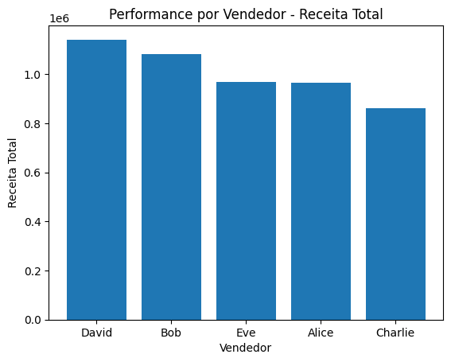
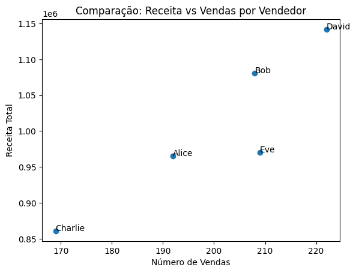
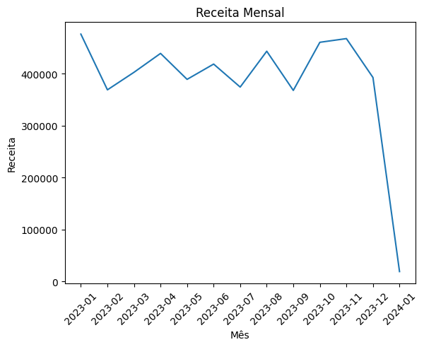

# Business Insights — Sales Analysis

## Principais descobertas

- A região com maior receita foi North (Norte).
- A melhor peformance geral foi obtida pelo vendedor David.
- Clientes recorrentes geram maior ticket médio.
- Canal Retail possui maior volume de vendas e receitas.
- Categoria mais lucrativa: Clothing (Roupas).

## Recomendações

- Investir em marketing na região de maior crescimento.
- Incentivar retenção de clientes.
- Otimizar preços de produtos com menor margem.

## 📊 Performance por Vendedor — Receita

---
### 🔎 Insights

✅ **David lidera em receita total**  
- Maior faturamento entre todos os vendedores.
- Maior volume de vendas, indicando alta produtividade comercial.

✅ **Bob apresenta forte desempenho**  
- Segunda maior receita.
- Alto volume de vendas, mostrando consistência.

✅ **Eve e Alice apresentam desempenho semelhante**  
- Receita próxima entre ambos.
- Potencial de crescimento com aumento de volume de vendas.

⚠️ **Charlie apresenta menor receita**  
- Menor volume de vendas.
- Pode indicar necessidade de melhoria em performance ou estratégia comercial.

---

### 💡 Recomendações
- Investigar estratégias utilizadas por David para replicação.
- Avaliar oportunidades de treinamento para vendedores com menor desempenho.
- Monitorar produtividade individual e conversão de vendas.

### 🔎 Visão geral
A receita mensal apresentou comportamento relativamente estável ao longo de 2023, com variações moderadas entre aproximadamente 370 mil e 470 mil por mês. O padrão indica consistência nas vendas, sem tendências claras de crescimento ou queda contínua no período.

## 📈 Comparação Receita vs Vendas

### 🔎 Insights

✅ **Correlação positiva entre vendas e receita**  
- Quanto maior o número de vendas, maior tende a ser a receita.
- Indica relação direta entre volume de vendas e faturamento.

✅ **David apresenta melhor desempenho geral**  
- Maior volume de vendas e maior receita.
- Indica alta eficiência comercial.

✅ **Bob possui alta geração de receita por venda**  
- Receita elevada com volume similar a outros vendedores.
- Sugere ticket médio elevado.

✅ **Alice demonstra boa eficiência**  
- Receita relevante mesmo com menor volume de vendas.
- Indica vendas de maior valor médio.

⚠️ **Charlie apresenta menor eficiência comercial**  
- Baixo volume e menor receita.
- Oportunidade de melhoria em conversão ou valor de vendas.

---

### 💡 Recomendações
- Avaliar estratégias de aumento do ticket médio.
- Identificar práticas de vendedores com maior eficiência.
- Implementar métricas de performance combinando volume e valor de vendas.

---

## 📈 Receita Mensal — Análise

---

### 📊 Principais insights

✅ **Maior receita:**  
- Janeiro/2023 → 476.092,36  
- Novembro/2023 → 467.482,90  
- Outubro/2023 → 460.378,78  

Esses meses representam os picos de faturamento do período, sugerindo maior demanda ou sazonalidade.

✅ **Menor receita em 2023:**  
- Setembro/2023 → 367.837,60  
- Fevereiro/2023 → 368.919,36  

Indica períodos de menor desempenho comercial.

✅ **Estabilidade ao longo do ano:**  
- Receita média mensal relativamente constante.
- Variações moderadas entre meses.
- Não há tendência clara de crescimento contínuo.

⚠️ **Queda acentuada em Janeiro/2024:**  
- Receita muito inferior aos demais meses.
- Provável mês incompleto ou dados parciais.
- Recomendado validar a integridade dos dados.

---

### 💡 Recomendações estratégicas

- Investigar fatores que impulsionaram vendas nos meses de maior receita.
- Analisar causas da queda nos meses de menor desempenho.
- Validar dados de 2024 antes de análises de tendência.
- Monitorar sazonalidade para planejamento de campanhas e estoque.

---

### 📌 Conclusão
O negócio apresenta receita estável ao longo de 2023, com variações sazonais moderadas. A consistência no faturamento indica operação equilibrada, mas oportunidades existem na otimização de períodos de menor desempenho e investigação de fatores que geram picos de receita.
